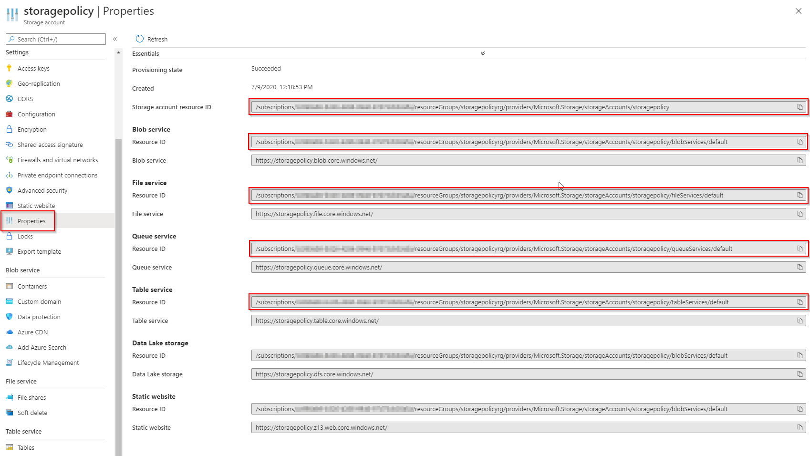
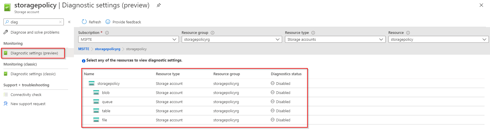

# Azure Storage monitoring policy

[Azure Storage logs in Azure Monitor](https://docs.microsoft.com/azure/storage/common/monitor-storage) is a new preview feature for Azure Storage logs which allows for a direct integration between your storage accounts and Log Analytics, Event Hubs, and archival of logs to another storage account utilizing standard diagnostic settings.

## Azure Storage resource types

Azure Storage is a unique Azure service in that each of its capabilities presents as its own resource type and a unique resource ID for provisioned resources.



Like many Azure services, you can enable diagnostic settings for Azure Storage using the Azure portal, the Azure CLI, or Azure PowerShell (see [Create diagnostic settings to send platform logs and metrics to different destinations](https://docs.microsoft.com/azure/azure-monitor/platform/diagnostic-settings)). When creating diagnostic settings through the Azure portal, resource selection and specifically resource ID resolution is handled for you.



### Azure CLI and Azure PowerShell

When creating diagnostic settings through the Azure CLI or Azure PowerShell, you will need the full resource ID to each storage type that the storage service surfaces which you would like to monitor. These can be found on the **Properties** blade of your storage account.

Outside of the Azure portal, you could also retrieve resource IDs through the Azure CLI with [az resource show](https://docs.microsoft.com/cli/azure/resource?view=azure-cli-latest#az-resource-show):

```sh
az resource show -g MyResourceGroup -n mystorageaccount --resource-type "Microsoft.Storage/storageAccounts"
```

Or Azure PowerShell with [Get-AzResource](https://docs.microsoft.com/powershell/module/az.resources/get-azresource?view=azps-4.3.0):

```powershell
Get-AzResource -ResourceGroupName MyResourceGroup -ResourceName mystorageaccount -ResourceType "Microsoft.Storage/storageAccounts"
```

Note that the output of each of these commands does not return the additional resource IDs for:

* blobServices
* fileServices
* queueServices
* tableServices

Which are returned by the Azure portal.

This means you need to construct these resource IDs manually in order to be able to set diagnostics for each feature of Azure storage that you wish to capture logs and metrics for.

```sh
ROOT_RESOURCE_ID=$(az resource show -g MyResourceGroup -n mystorageaccount --resource-type "Microsoft.Storage/storageAccounts" --query id -o tsv)
BLOB_RESOURCE_ID="${ROOT_RESOURCE_ID}/blobServices/default"
FILE_RESOURCe_ID="${ROOT_RESOURCE_ID}/fileServices/default"
QUEUE_RESOURCE_ID="${ROOT_RESOURCE_ID}/queueServices/default"
TABLE_RESOURCE_ID="${ROOT_RESOURCE_ID}/tableServices/default"
```

With these values and the values for the resource IDs for the destinations you would like to send our metrics and logs to such as another storage account or a Log Analytics workspace, you can use [az monitor diagnostic-settings create](https://docs.microsoft.com/cli/azure/monitor/diagnostic-settings?view=azure-cli-latest#az-monitor-diagnostic-settings-create) or [Set-AzDiagnosticSetting](https://docs.microsoft.com/powershell/module/az.monitor/set-azdiagnosticsetting?view=azps-4.3.0) to create your diagnostic settings.

### Azure Resource Manager templates

When creating diagnostic settings through an Azure Resource Manager template, you will need to resolve the correct resource type for the `diagnosticSettings` you wish to enable.

They are as follows:

| Resource | Resource type |
| -------- | ------------- |
| Storage account | `Microsoft.Storage/storageAccounts/providers/diagnosticSettings` |
| blobServices | `Microsoft.Storage/storageAccounts/blobServices/providers/diagnosticSettings` |
| fileServices | `Microsoft.Storage/storageAccounts/fileServices/providers/diagnosticSettings` |
| queueServices | `Microsoft.Storage/storageAccounts/queueServices/providers/diagnosticSettings` |
| tableServices | `Microsoft.Storage/storageAccounts/tableServices/providers/diagnosticSettings` |

### Discovering diagnostic settings categories

Each Azure resource that supports diagnostic settings supports a per-service set of logs and and metrics that can be collected. This means that a service such as a virtual network (`Microsoft.Network/virtualNetworks`) may have a different set of telemetry provided by the service than Azure Storage (`Microsoft.Storage/storageAccounts`) and because storage has its root resource type in addition to the other resource types it presents (blobs, files, tables, and queues), this means that each resource type you want to collect telemetry for can have its own unique diagnostic setting categories.

Azure Monitor has a REST API available which can help you discover the available categories and their supported properties referred to as [Diagnostic Settings Category - List](https://docs.microsoft.com/rest/api/monitor/diagnosticsettingscategory/list). The output of this API can be used to construct your Azure Resource Manager templates, Azure CLI, or Azure PowerShell commands when creating and updated diagnostic settings.

To discover the available diagnostic settings for Azure Storage, you can use the following URIs, replacing the values for `{subscription-id}`, `{resource-group}`, and `{resource-name}` with your values.

| Resource | URI |
| -------- | --- |
| Storage account | `GET https://management.azure.com/subscriptions/{subscription-id}/resourceGroups/{resource-group}/providers/Microsoft.Storage/storageAccounts/{resource-name}/providers/microsoft.insights/diagnosticSettingsCategories?api-version=2017-05-01-preview` |
| blobServices | `GET https://management.azure.com/subscriptions/{subscription-id}/resourceGroups/{resource-group}/providers/Microsoft.Storage/storageAccounts/{resource-name}/blobServices/default/providers/microsoft.insights/diagnosticSettingsCategories?api-version=2017-05-01-preview` |
| fileServices | `GET https://management.azure.com/subscriptions/{subscription-id}/resourceGroups/{resource-group}/providers/Microsoft.Storage/storageAccounts/{resource-name}/fileServices/default/providers/microsoft.insights/diagnosticSettingsCategories?api-version=2017-05-01-preview` |
| queueServices | `GET https://management.azure.com/subscriptions/{subscription-id}/resourceGroups/{resource-group}/providers/Microsoft.Storage/storageAccounts/{resource-name}/queueServices/default/providers/microsoft.insights/diagnosticSettingsCategories?api-version=2017-05-01-preview` |
| tableServices | `GET https://management.azure.com/subscriptions/{subscription-id}/resourceGroups/{resource-group}/providers/Microsoft.Storage/storageAccounts/{resource-name}/tableServices/default/providers/microsoft.insights/diagnosticSettingsCategories?api-version=2017-05-01-preview` |

The response will be similar to the following:

```json
{
  "value": [
    {
      "id": "/subscriptions/00000000-0000-0000-0000-000000000000/resourcegroups/MyResourceGroup/providers/microsoft.storage/storageaccounts/mystorageaccount/blobservices/default/providers/microsoft.insights/diagnosticSettingsCategories/StorageRead",
      "type": "microsoft.insights/diagnosticSettingsCategories",
      "name": "StorageRead",
      "location": null,
      "kind": null,
      "tags": null,
      "properties": {
        "categoryType": "Logs"
      },
      "identity": null
    },
    {
      "id": "/subscriptions/00000000-0000-0000-0000-000000000000/resourcegroups/MyResourceGroup/providers/microsoft.storage/storageaccounts/mystorageaccount/blobservices/default/providers/microsoft.insights/diagnosticSettingsCategories/StorageWrite",
      "type": "microsoft.insights/diagnosticSettingsCategories",
      "name": "StorageWrite",
      "location": null,
      "kind": null,
      "tags": null,
      "properties": {
        "categoryType": "Logs"
      },
      "identity": null
    },
    {
      "id": "/subscriptions/00000000-0000-0000-0000-000000000000/resourcegroups/MyResourceGroup/providers/microsoft.storage/storageaccounts/mystorageaccount/blobservices/default/providers/microsoft.insights/diagnosticSettingsCategories/StorageDelete",
      "type": "microsoft.insights/diagnosticSettingsCategories",
      "name": "StorageDelete",
      "location": null,
      "kind": null,
      "tags": null,
      "properties": {
        "categoryType": "Logs"
      },
      "identity": null
    },
    {
      "id": "/subscriptions/00000000-0000-0000-0000-000000000000/resourcegroups/MyResourceGroup/providers/microsoft.storage/storageaccounts/mystorageaccount/blobservices/default/providers/microsoft.insights/diagnosticSettingsCategories/Capacity",
      "type": "microsoft.insights/diagnosticSettingsCategories",
      "name": "Capacity",
      "location": null,
      "kind": null,
      "tags": null,
      "properties": {
        "categoryType": "Metrics"
      },
      "identity": null
    },
    {
      "id": "/subscriptions/00000000-0000-0000-0000-000000000000/resourcegroups/MyResourceGroup/providers/microsoft.storage/storageaccounts/mystorageaccount/blobservices/default/providers/microsoft.insights/diagnosticSettingsCategories/Transaction",
      "type": "microsoft.insights/diagnosticSettingsCategories",
      "name": "Transaction",
      "location": null,
      "kind": null,
      "tags": null,
      "properties": {
        "categoryType": "Metrics"
      },
      "identity": null
    }
  ]
}
```

The returned response can be used to construct the strings needed for input to your Azure Resource Manager template(s) or `az monitor diagnostic-settings create`.

```json
"metrics": [
    {
        "category": "Capacity",
        "enabled": "true",
        "retentionPolicy": {
            "enabled": false,
            "days": 0
        }
    },
    {
        "category": "Transaction",
        "enabled": "true",
        "retentionPolicy": {
            "enabled": false,
            "days": 0
        }
    }
],
"logs": [
    {
        "category": "StorageRead",
        "enabled": true,
        "retentionPolicy": {
            "days": 0,
            "enabled": false
        }
    },
    {
        "category": "StorageWrite",
        "enabled": true,
        "retentionPolicy": {
            "days": 0,
            "enabled": false
        }
    },
    {
        "category": "StorageDelete",
        "enabled": true,
        "retentionPolicy": {
            "days": 0,
            "enabled": false
        }
    }
]
```
